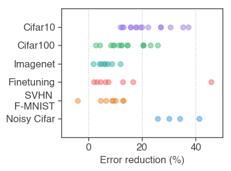
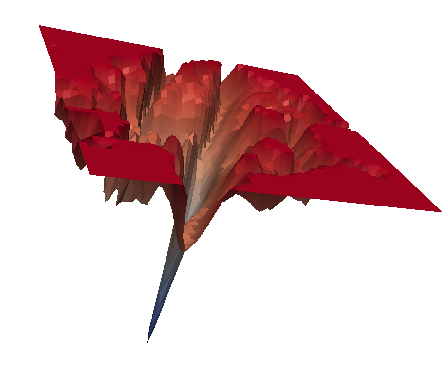
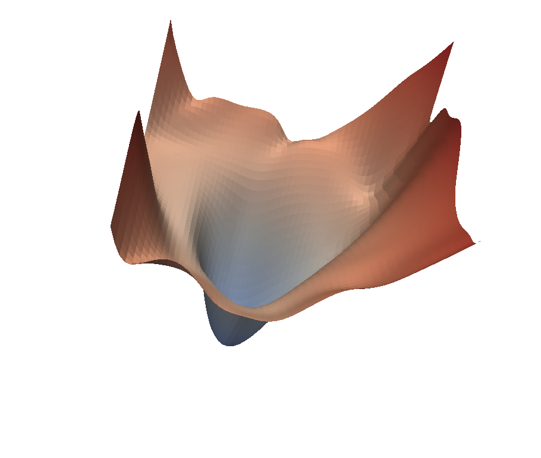

# SAM: Sharpness-Aware Minimization for Efficiently Improving Generalization

by Pierre Foret, Ariel Kleiner, Hossein Mobahi and Behnam Neyshabur.


## SAM in a few words

**Abstract**: In today's heavily overparameterized models, the value of the training loss provides few guarantees on model generalization ability. Indeed, optimizing only the training loss value, as is commonly done, can easily lead to suboptimal model quality. Motivated by the connection between geometry of the loss landscape and generalization---including a generalization bound that we prove here---we introduce a novel, effective procedure for instead simultaneously minimizing loss value and loss sharpness. In particular, our procedure, Sharpness-Aware Minimization (SAM), seeks parameters that lie in neighborhoods having uniformly low loss; this formulation results in a min-max optimization problem on which gradient descent can be performed efficiently. We present empirical results showing that SAM improves model generalization across a variety of benchmark datasets (e.g., CIFAR-{10, 100}, ImageNet, finetuning tasks) and models, yielding novel state-of-the-art performance for several. Additionally, we find that SAM natively provides robustness to label noise on par with that provided by state-of-the-art procedures that specifically target learning with noisy labels.


|          |     |       |
|:--------------:|:----------:|:----------------------:|
| Error rate reduction obtained by switching to SAM. Each point is a different dataset / model / data augmentation | A sharp minimum to which a ResNet trained with SGD converged | A wide minimum to which the same ResNet trained with SAM converged. |


## About this repo

This code allows the user to replicate most of the experiments of the paper, including:

 * Training from scratch Wideresnets and Pyramidnets (with shake shake / shake drop) on CIFAR10/CIFAR100/SVHN/Fashion MNIST, with or without SAM, with or without cutout and AutoAugment.
 * Training Resnets and Efficientnet on Imagenet, with or without SAM or RandAugment.
 * Finetuning Efficientnet from checkpoints trained on Imagenet/JFT on imagenet.


## How to train from scratch

Once the repo is cloned, experiments can be launched using sam.sam_jax.train.py:

```
python3 -m sam.sam_jax.train --dataset cifar10 --model_name WideResnet28x10 \
--output_dir /tmp/my_experiment --image_level_augmentations autoaugment \
--num_epochs 1800 --sam_rho 0.05
```

Note that our code uses all available GPUs/TPUs for training.

To see a detailed list of all available flags, run python3 -m sam.sam_jax.train --help.

#### Output

Training curves can be loaded using TensorBoard. TensorBoard events will be
saved in the output_dir, and their path will contain the learning_rate,
the weight_decay, rho and the random_seed.

## Coming soon:

We will opensource the FLAX checkpoints for efficientnet soon.


## Bibtex

```
@ARTICLE{2020arXiv201001412F,
       author = {{Foret}, Pierre and {Kleiner}, Ariel and {Mobahi}, Hossein and {Neyshabur}, Behnam},
        title = "{Sharpness-Aware Minimization for Efficiently Improving Generalization}",
         year = 2020,
          eid = {arXiv:2010.01412},
       eprint = {2010.01412},
}
```

**This is not an official Google product.**
